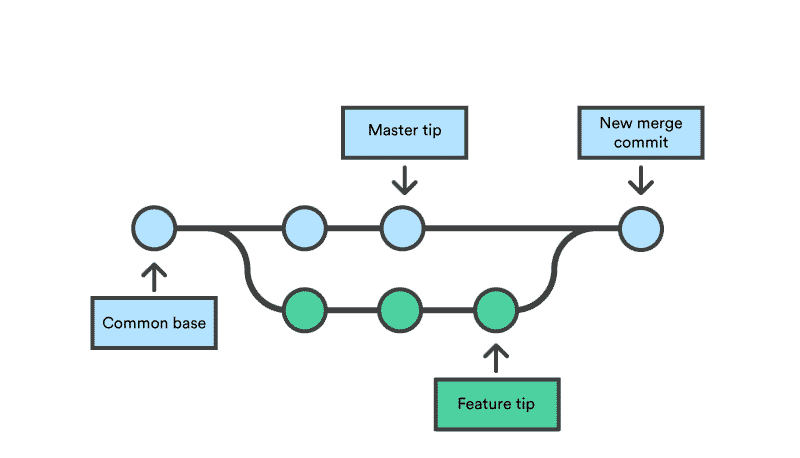

# Introduction

Version Control System (VCS) is an integral part of a software developer's job experience. From the author's personal experience and @spinellis2005version, we know that programmers do not write production code without the use of an editor, interpreter, or compiler. If the programmers use the production code with version control at this time, they risk the feature update to break the whole platform without having a backup to roll back on.

Software version control is an extension to a human's typical behavior not to be able to envision the future says @spinellis2005version. A version control system gives reliable tools to rely upon and build better programs.

There are two types of version control as explained by @10.1145/1562164.1562183, 1. Concurrent Version System (CVS) and 2. Revision Control System (RCS). The concurrent version system is a legacy system that was slowly phased out in favor of the recurrent version system. CVS used to follow the server-client model. A central server hosted the project code or the source code. The clients can check out a limited view of the data hosted by the server. RCS started around the early 2000s and was recognized by Git @10.1145/1562164.1562183. Here every project contains its history and metadata. Any user can check out any part of the project without any limitations. This user action can be controlled with authentication or open for all. 

Paraphrasing authors @hunt2003pragmatic, *A project without version control is like a process without an undo button...*. There are multiple uses of the version control system. The most used ones are mentioned in the following section.

# Implementation

A software version control system in the Revision Control System model offers many features that assist the developers in many functions and conveniences. Some of them are mentioned below.

## Version History
One of the crucial features that a Software Version Control system offers is the ability to roll back to any previous version that worked for the platform at a moment's notice. If a feature update breaks the platform, the company should be able to roll back to any previous version that worked. This minimizes the impact that the platform may suffer, keeping the capital loss to a minimum.

## Co-Develop
The source code is controlled using the company's authentication and authorization walls or open-source code hosted on a free-to-use platform. Any developer can pull the code from the source and make the changes needed to improve the functionality of the source code. This operation does not disturb the source file. It gives developers the option to work on parts of the code rather than the whole.

## Peer Review
Upon making changes for the source code, if the developer wishes the changes should be implemented for the whole platform, they can make a merge request with the changes. However, of course, this enhanced code still has to be peer-reviewed and made sure that it follows the rules maintained by the owner of the company for a smooth operation.

## Scalability
This process should be salable. Any number of developers can pick up the scope and start without delay.

## Commit History
Not all the changes need to be saved for the code. However, when a commit is made to save the changes, that is when it should save a version of the changes and pack it for review.

## Continuous Integration and Continuous Development
Combining all the features of a modern software version control system, it handles all the changes simultaneously. It notifies the developer when the source branch changes, making the integration quick and easy where it needs to be managing the version change history. Then, once a merge request is made, make the changes on the source version to seamlessly integrate the changes.

## Automated Testing
Testing can also be automated to check the essential functions of the code. This testing can be user-driven or platform-driven. This can act as the first and last stop on the changes to the main version of the code.

# Solutions
Three widely used solutions make all these features available for anyone to use. An individual or a multi-national conglomerate can use these solutions. 1. GitHub, 2. GitLab, and 3. Bitbucket. All three solutions offer similar functions. More about them @gupta-2021; @moducate-2022

# Conclusion
Version Control System is an integral part of the whole software development process. It gives a good base for the developers to work develop. They are giving a platform to spring from and a platform to fall back on.

\newpage

# References

::: {#refs custom-style="Bibliography"}
:::
